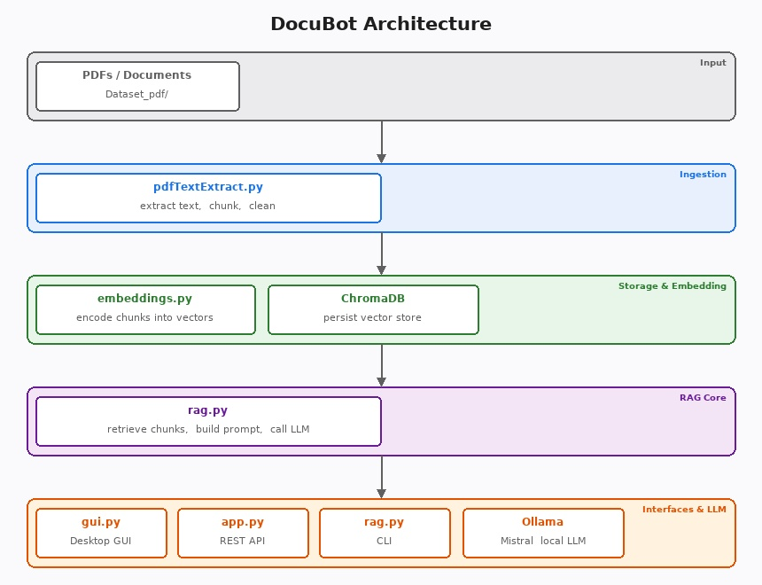

# DocuBot Local

A personal, offline document assistant. Like ChatGPT for your own notes, PDFs, and
research papers. It runs entirely on your machine using a local LLM (Mistral via
Ollama) and a local vector database (ChromaDB), so your documents never leave
your computer.

> **Disclaimer:** DocuBot is a personal productivity tool, not a professional service.
> Answers are generated by a local LLM and may be incomplete, inaccurate, or
> misleading. Do not rely on it for legal, medical, financial, or other
> professional advice. Always verify important information against the original
> source documents.

## What it does

- Ingests your documents (PDFs, notes, articles) and stores them in a searchable
  vector index
- Finds the passages most relevant to your question
- Generates an answer using a local LLM, grounded in those passages (RAG)
- Exposes a desktop GUI, an interactive CLI, and a REST API

## Why

- Search legal contracts, study notes, or internal docs without uploading
  anything to the cloud
- Useful for researchers, students, or businesses handling sensitive data
- Works fully offline (e.g., on a flight or in the field)

## Architecture



| Component | File | Role |
| --- | --- | --- |
| PDF ingestion | `pdfTextExtract.py` | Extracts text from PDFs, cleans it, and splits it into overlapping token-based chunks |
| Embeddings | `embeddings.py` | Embeds chunks with `all-MiniLM-L6-v2` and stores them in ChromaDB |
| RAG core | `rag.py` | Retrieves relevant chunks for a question and queries Ollama (Mistral) for an answer |
| API | `app.py` | Flask server exposing a `POST /query` endpoint |
| Desktop GUI | `gui.py` | Tkinter desktop app with a chat-style interface |
| Examples | `example_usage.py` | End-to-end ingestion + query script |

## Requirements

- Python 3.8+
- [Ollama](https://ollama.com) with the Mistral model pulled
- `python3-tk` (Linux only — bundled with Python on Windows)

> **Privacy notice:** All processing happens locally on your machine. No data is
> sent to external servers. The only network calls are to your local Ollama
> instance (`localhost:11434`).

## Setup

1. Install [Ollama](https://ollama.com) and pull a model. Mistral is a good default, but any model available on Ollama works:
   ```bash
   ollama pull mistral
   ```
   You can switch models at any time from the model dropdown in the GUI, or by changing `OLLAMA_MODEL` in `rag.py`.
2. Create a virtual environment and install dependencies:
   ```bash
   python -m venv .venv
   source .venv/bin/activate   # Windows: .venv\Scripts\activate
   pip install -r requirements.txt
   ```
3. (Linux only) Install tkinter if not already present:
   ```bash
   sudo apt-get install python3-tk
   ```

## Usage

### 1. Ingest documents

Place your PDFs in a folder (e.g., `Dataset_pdf/`) and run:

```bash
python pdfTextExtract.py Dataset_pdf/
python embeddings.py
```

Or use the all-in-one script which does both steps and runs example queries:

```bash
python example_usage.py
```

### 2. Ask questions

You have three ways to interact with DocuBot — pick whichever suits you:

**Option A — Desktop GUI** (recommended for most users)
```bash
python gui.py
```

**Option B — Command-line interface**

Interactive session (multi-turn):
```bash
python rag.py
```

One-shot query:
```bash
python rag.py "What is the attention mechanism?"
```

**Option C — REST API** (for integrations or scripting)
```bash
python app.py
# then query it with:
curl -X POST http://localhost:5000/query \
  -H "Content-Type: application/json" \
  -d '{"question": "What is the attention mechanism?"}'
```

## Limitations

- Answers are only as good as the documents you provide. If the answer is not in
  your dataset, the model will say so (or may hallucinate, always check sources).
- Large PDFs with complex layouts (tables, figures, equations) may not extract
  cleanly.
- Response speed depends on your hardware. A GPU significantly improves Ollama
  inference time.
- The SQLite version bundled with some Linux distributions is too old for
  ChromaDB; `pysqlite3` is used as a workaround automatically.

